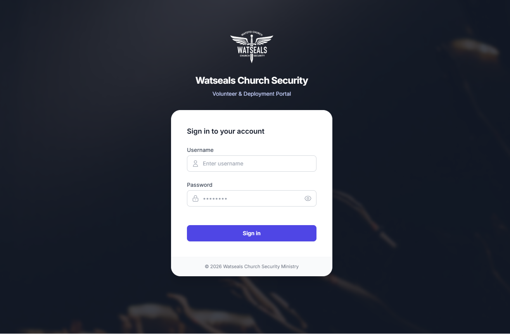
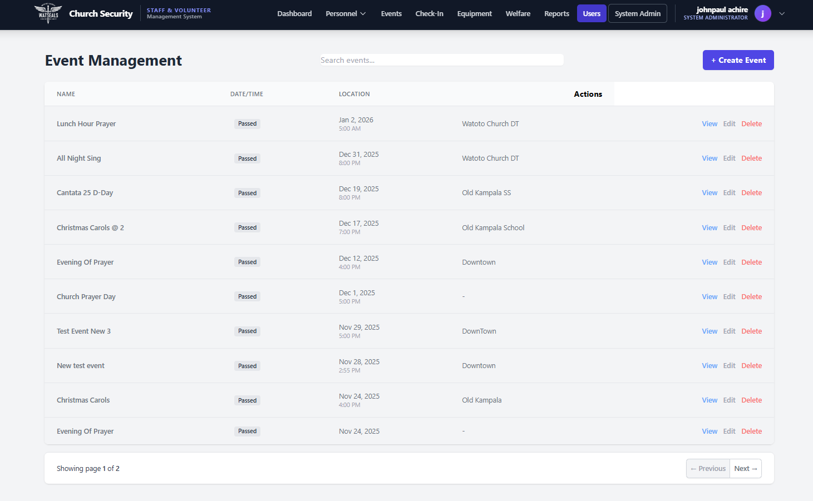

# Church Security Deployment & Operations System

## Status
🟢 Live Production System

## Overview
An operational management system used to coordinate church security personnel, volunteers, event deployments, and equipment allocation.

The platform ensures structured planning, accountability, and efficient resource distribution for security operations.

## Problem It Solves
Manual coordination of volunteers and security teams leads to:
- scheduling conflicts
- missing personnel
- poor accountability
- lost equipment tracking

This system centralizes all operations into a single controlled platform.

## Core Features
- Personnel deployment scheduling
- Event security assignment
- Check-in tracking
- Equipment dispatch logging
- Role-based management controls

## Tech Stack
Backend: Python-based system  
Frontend: Web interface  
Database: Structured relational storage  
Deployment: Hosted server environment

## Architecture
The system is built using a layered architecture:
- Interface layer
- Logic layer
- Database layer
- Access control layer

See `/architecture` directory for diagrams.

## Application Walkthrough

### Login Portal

### Deployment Dashboard

### Event List

### Event Creation

### Dashboard Update

## Security Considerations
- Permission-based access
- Audit logs
- Restricted admin functions
- Input sanitization

## Engineering Challenges Solved
- Scheduling conflict detection
- Real-time assignment updates
- Data consistency controls
- Multi-user environment handling

## Roadmap
- Mobile interface
- Automated alerts
- Reporting module
- API endpoints

## Source Code Notice
The source code is private due to operational security considerations. Demonstrations are provided through documentation and screenshots.
