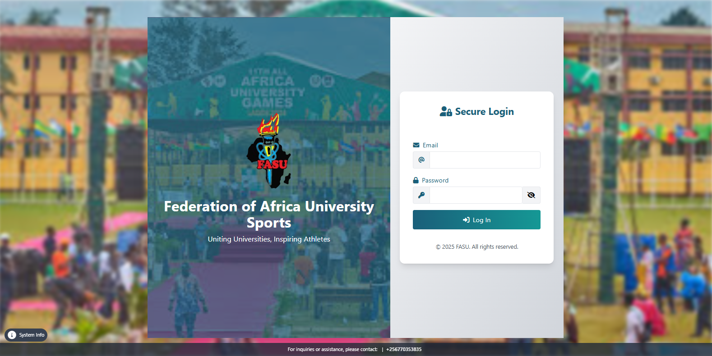
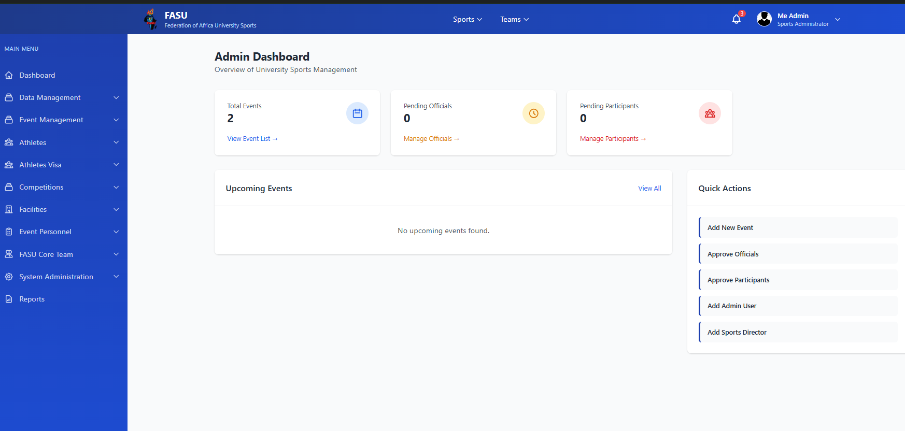
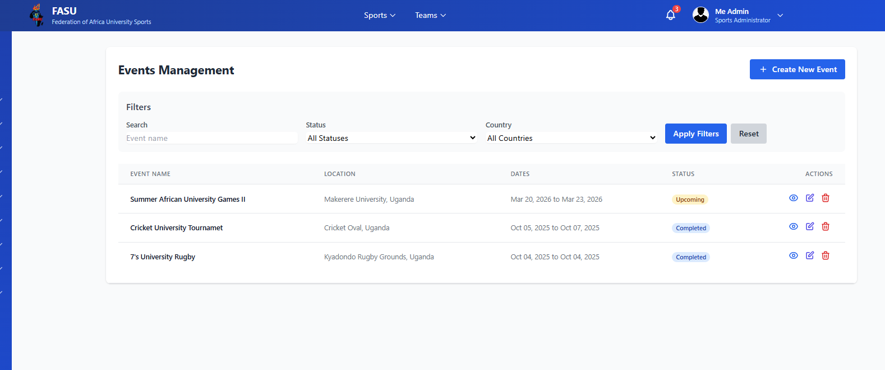
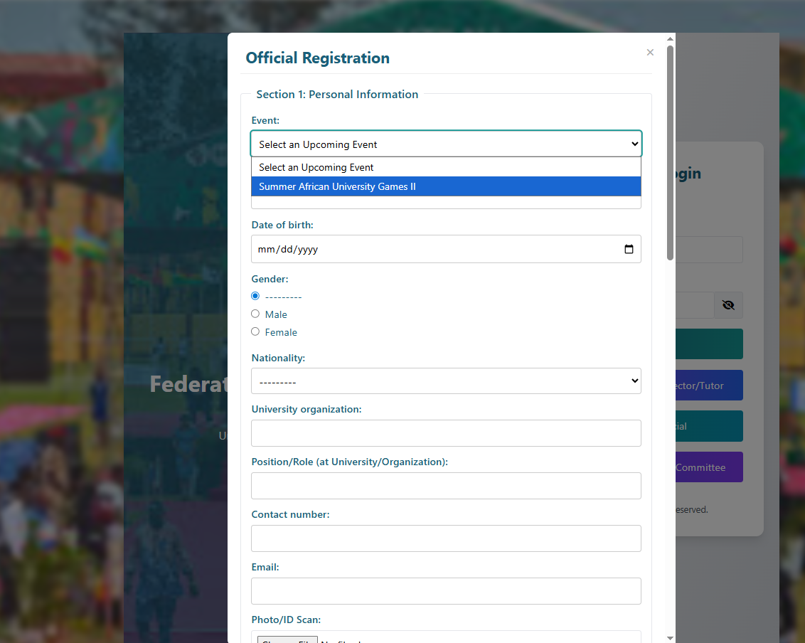
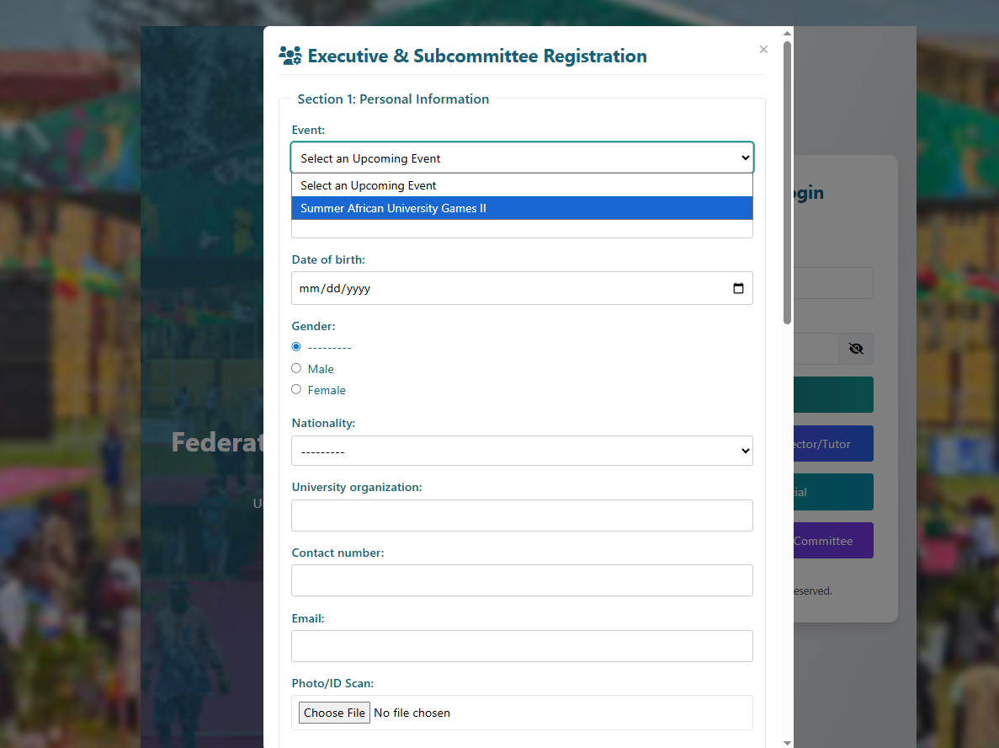
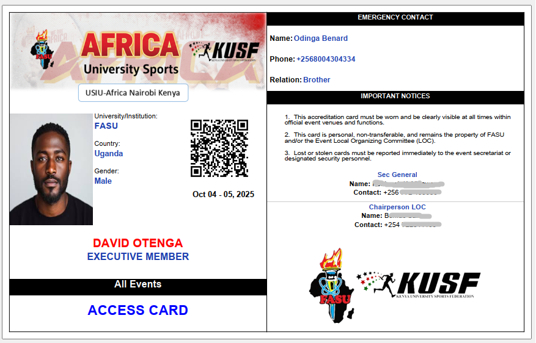

# University Sports Management System

## Status
🟢 Live Production System

## Overview
A centralized digital platform designed to manage inter university sports operations including event coordination, participant management, and accreditation generation.

This system replaces manual administrative processes with automated workflows for improved efficiency, accuracy, and accountability.

## Problem It Solves
Universities often rely on spreadsheets and manual tracking for sports events. This system provides:
- Centralized management
- Automated accreditation
- Structured event coordination
- Administrative visibility

## Core Features
- Athlete and official registration
- Event scheduling and coordination
- Accreditation card generation
- Role-based access
- Record tracking and reporting

## Tech Stack
Backend: Python-based framework  
Frontend: Web interface (HTMX/tailwinds/JS-Alpine)  
Database: Relational DB 
Environment: Production server deployment

## Architecture
The system follows a modular architecture separating:
- User interface
- Business logic
- Data storage
- Access control

See `/architecture` folder for diagrams.

## Application Walkthrough

### Login Interface

### Dashboard Overview

### Create Sports Event

### Event Management Panel

### Login Interface II

### Sports Director Registration

### Official Registration

### Executive Registration

### Accreditation Card

## Security Considerations
- Role-based authorization
- Input validation
- Secure session handling
- Access logging

## Engineering Challenges Solved
- Automated ID generation logic
- Dynamic data validation
- Multi-role access control
- Structured event data relationships

## Roadmap
- Reporting analytics module
- Mobile responsiveness improvements
- API integrations
- Performance optimization

## Source Code Notice
Source code is not publicly available because the system is actively deployed and contains sensitive operational logic. Documentation and demonstrations are provided instead.

